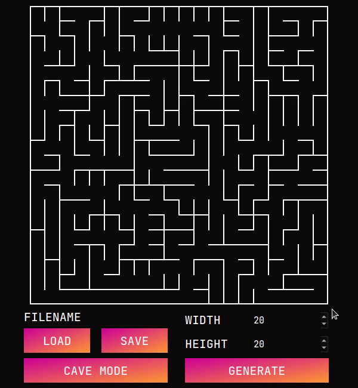
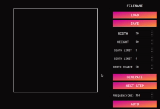

# MAZE


## Content

This project implements the generation of a maze and the search for the shortest path between two given points on the constructed
maze. Additionally, there is a function of building caves.

1) The generation of caves is carried out by the Eller method (http://www.neocomputer.org/projects/eller.html ).
2) The generation of caves is carried out on the basis of a cellular automaton (https://en.wikipedia.org/wiki/Cellular_automaton ).

To build , you need:

1) `CMAKE 3.5` or higher
2) `QT 5.15.2` or higher

To build from the root of the project:

```shell
cmake -S ./src/ -B ./build/ && cmake --build ./build --target Maze
```

The path to the archive with data from the project root:
```shell
./datasets/data.tar.gz
```

## Work example




## Mazes

As already mentioned, the construction of mazes is carried out using the Eller algorithm, finding the path
by searching in depth.

1) Generation is carried out by pressing the `GENERATE` button with the specified parameters of the number of rows and columns
   of the maze.
2) The number of rows and columns of the maze are adjusted using the SpinBox (1-50).
3) To find the path, you need to use the `LMB` to click on the first point and repeat the steps for the second point.
   The shortest path from point 1 to point 2 will be constructed.
4) To clear the built path - click `PCM` on the rendering scene.
5) To load the maze from a txt file - the `LOAD` button.
6) To save the maze to a txt file - the `SAVE` button.


## Caves

The construction of caves takes place on the basis of a cellular automaton, but with a slight difference in that it is possible
to adjust the parameters for birth and death. Automatic operation mode is also provided for convenient visualization.
To switch to cave mode - you need to press the `CAVE MODE` button

1) Generation is carried out by pressing the `GENERATE` button with the specified parameters of the number of rows, columns, the limit of birth,
   the limit of death and the chance of the initial appearance of the cell.
2) In order to move to the next state of the caves - the `NEXT STEP' button.
3) The number of rows and columns of the cave are adjusted using the SpinBox (1-50).
4) The limits of birth and death of cells are adjusted using the SpinBox (0-7).
5) The chance of the initial appearance of the cells are adjusted using the SpinBox (1-100).
6) You can switch to automatic generation mode, there is an `AUTO` button for this.
7) For automatic operation mode, you can set the step frequency in milliseconds (300-2000).
8) To load a cave from a txt file, use the `LOAD` button.
9) To save the cave to a txt file - the `SAVE` button.

Authors:
1) A. Savin aka telvina <sav1nru@mail.ru>
2) A. Degtyarev aka sreanna
